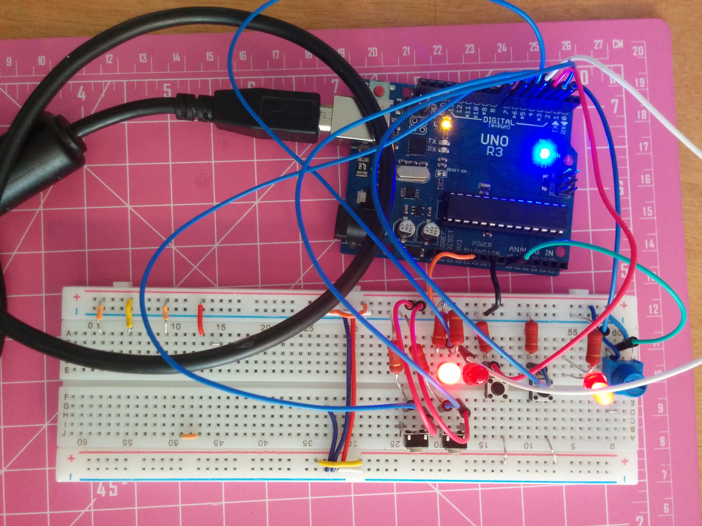
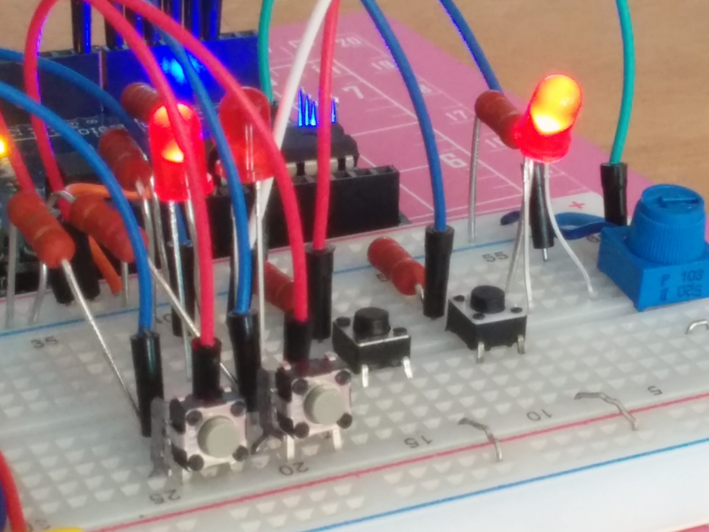
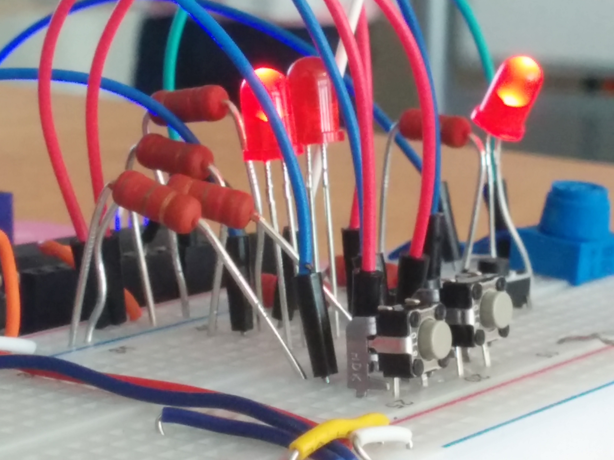

# One Bit Computer

One bit computer made for Teayoon Choi's Hardware class at SFPC

## Right to left
- Clock Speed
- Clock display
- Input A and Input B
- Leds show binary addition of A + B
- Right button saves addition state to memory
- Left button erases memory state

